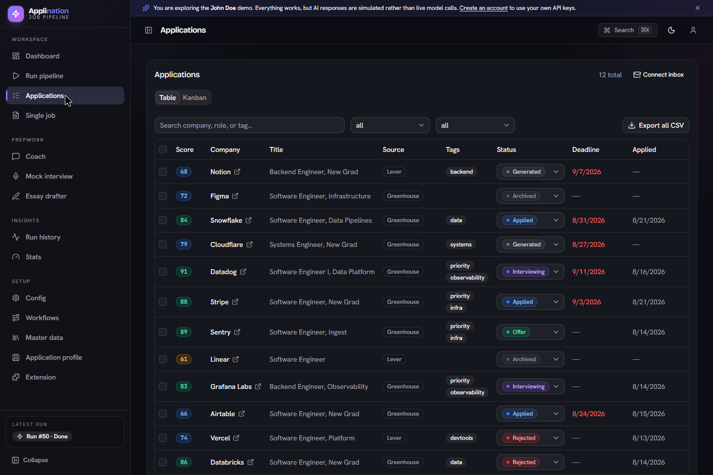
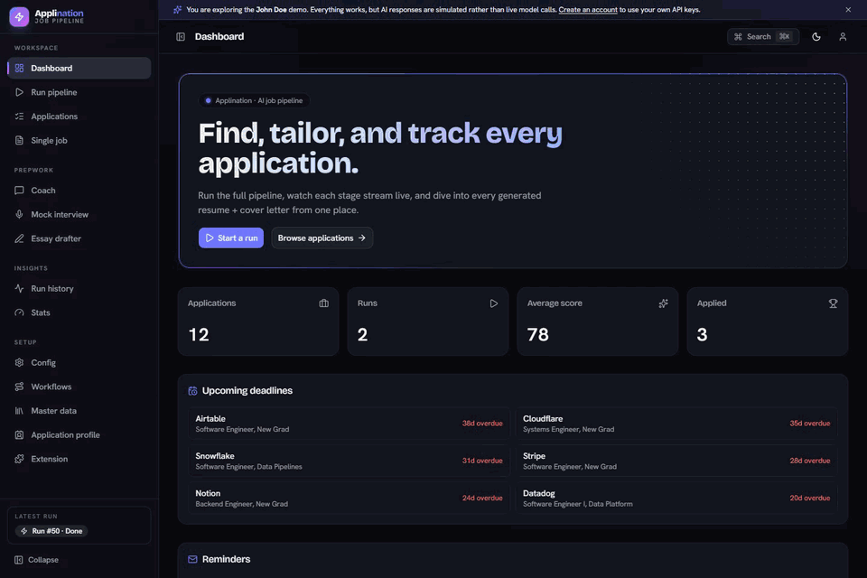
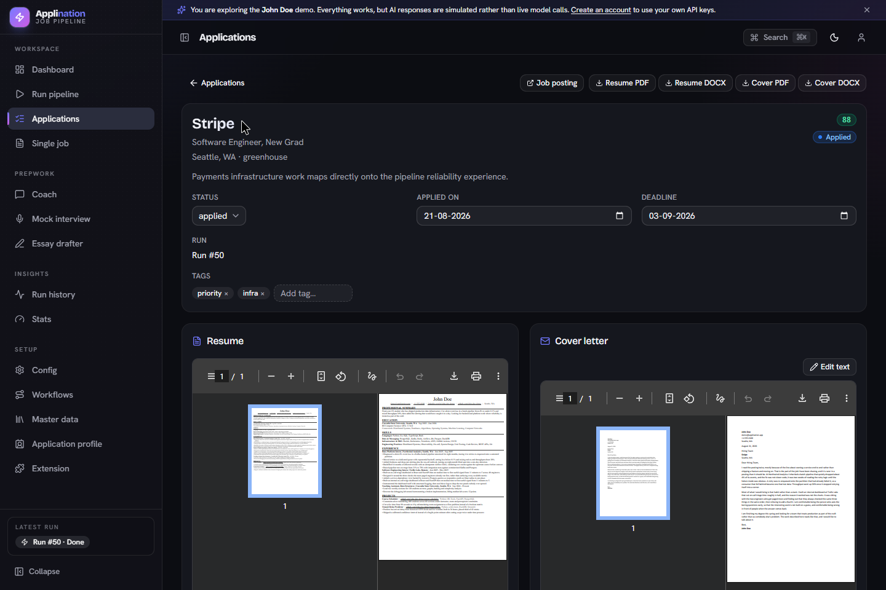
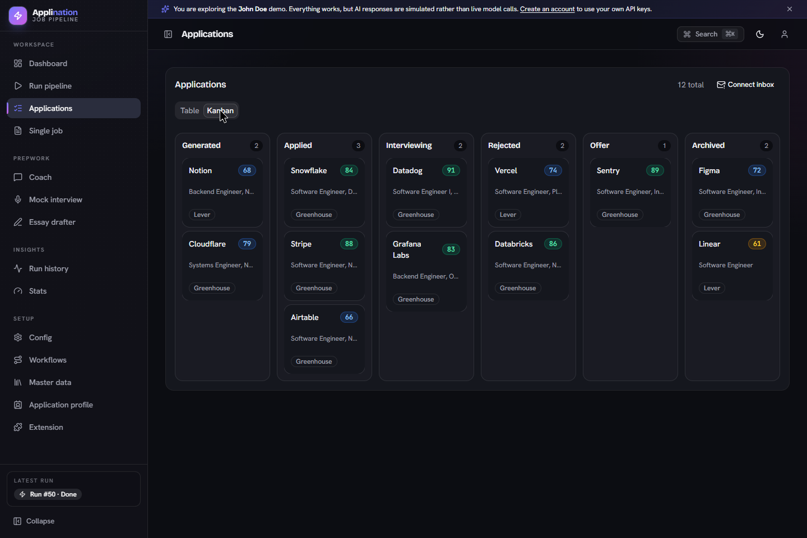
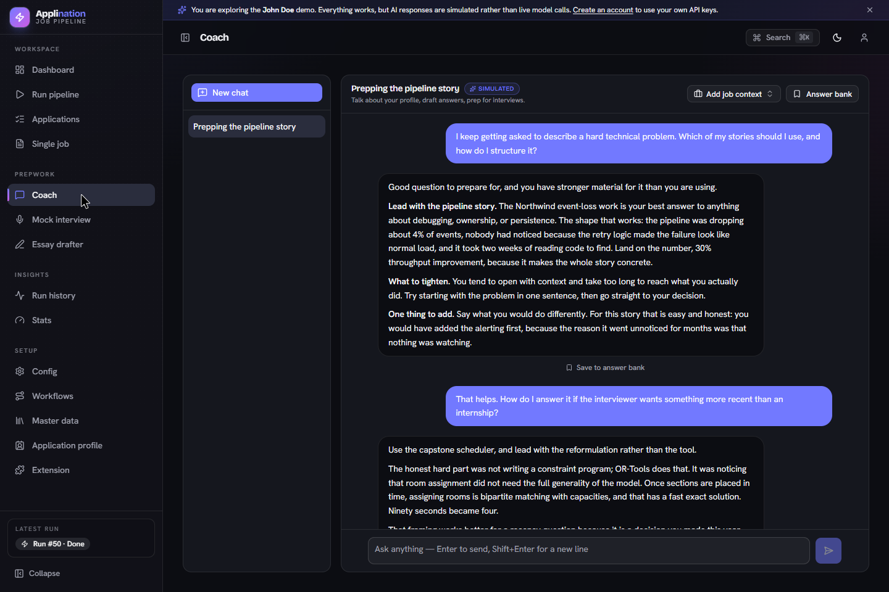

# Applination

**Find jobs that fit your background, prepare an application for each one, and keep track of what happens next.**

Applination helps with the repetitive parts of a job search: reading postings, tailoring your resume, drafting cover letters, and organizing applications. Give it your experience and the roles you want, then review a shortlist with application materials ready to edit and download.

[Open Applination](https://applination.sanchitarora.me) · [Try the demo](https://applination.sanchitarora.me/login) · [Technical guide](docs/TECHNICAL.md)

  

<em>Your applications, match scores, and next steps in one place. Click any screenshot to view it full size.</em>

## Try it before setting anything up

Open the app and choose **Try the demo** on the sign-in page. You will enter a shared workspace for **John Doe**, a fictional candidate with a profile, ranked jobs, resumes, cover letters, and interview-prep conversations already filled in. No signup or AI key is needed.

A guided tour introduces the screens. Skip it whenever you like, or replay it from the account menu. The demo uses simulated AI responses and resets nightly, so use your own account for work you want to keep.

### Watch a walkthrough

  

[Watch or download the full recording](docs/media/applination-walkthrough.webm). The preview is sped up; the recording shows navigation through the live demo. All screenshots and recordings use fictional demo data, and its AI responses are simulated.

## From your experience to your next application

1. **Build your profile.** Upload an existing resume and add your experience, skills, and a few stories about your work. Applination uses this background when writing documents and helping you prepare for interviews.
2. **Choose your search.** Set the roles, locations, and job types you want, a minimum match score, and how many applications to prepare.
3. **Find and review matches.** Start a run to collect postings from the sources you enable and score them against your profile. Review the ranked list, select promising jobs, or bring back a posting that missed the cutoff.
4. **Review your materials.** Open each application to read its tailored resume and cover letter. Ask for changes, compare resume versions, and download Word or PDF files.
5. **Apply and follow up.** Submit on the employer's website, then track the application through applied, interviewing, offer, or rejected. Keep notes, tags, and deadlines alongside the documents.

You can run a search when you need it or schedule runs. If you have already found a role, use **Single job** to paste its URL or enter the description and prepare materials for that posting.

## What you can do

### Spend less time sorting through postings

Each match has a score out of 100 and an explanation of how it relates to your background. Your cutoff and document limit help you decide where to spend time. The full ranked list stays available for your own review; a score is a recommendation, not a prediction of an interview or offer.

Use a **dry run** to fetch and score jobs before generating documents. It still uses your scoring model, but skips the document-writing calls.

### Tailor and revise your application materials

Applination adapts resume bullets to the role and draws on your saved stories when drafting a cover letter. Documents use a plain layout designed for applicant tracking systems and aim to fit on one page.

Review every draft for accuracy before sending it. You can request a resume change in plain language, compare versions side by side, or edit the cover-letter text. Download Word files for further editing and PDFs for submission when PDF conversion is available.

  

<em>Review the match and both documents before applying.</em>

### Keep applications and follow-ups organized

Switch between a table and a Kanban board, filter your applications, update stages, and add notes or tags. Export a CSV when you want to work in a spreadsheet. Run history and charts help you review what your searches produced.

Optional Gmail sync can classify company replies in your browser and update application stages. A calendar feed brings deadlines and interviews into your calendar app; a daily email digest is available when Gmail is connected. These features need to be configured before use.

  
See the Kanban board

  

    
  

### Prepare answers using your own experience

The **Coach** helps you choose and structure examples from your background. **Mock interview** asks questions one at a time and gives feedback on your answers. **Essay drafter** helps with longer application questions. Save useful answers in your answer bank so you can return to them later.

  

<em>Prepare with the experience and stories already in your profile.</em>

### Fill application forms with the browser extension

The Chrome extension can fill contact details, reuse saved answers, draft responses, and attach generated documents on supported application forms. Review the fields and uploaded files before submitting. Some websites have custom controls that need manual input.

Install and connect it from **Extension** in the app. See the [extension guide](extension/README.md) for the steps and supported behavior.

## Start with your own profile

1. [Create an account](https://applination.sanchitarora.me/signup).
2. Connect an AI provider you have access to, or pair a local Ollama model from **Config**.
3. Complete the guided setup with your contact details, resume, work stories, and search preferences.
4. Try a dry run, review the matches, then generate materials for the jobs you want.

Update your background in **Master data**, recurring form details in **Application profile**, and search preferences in **Config**. Use **Workflows** to choose the model for each task.

### AI choice and costs

You bring your own provider credentials. Supported options include OpenAI, Anthropic, Google, DeepSeek, Groq, Mistral, OpenRouter, Nvidia, and Cloudflare. Provider charges depend on your model and usage. Ollama can run on your computer without AI provider charges; keep its paired local worker running while Applination needs it.

For bulk generation, **Lower cost** mode offers discounted processing with supported OpenAI, Claude, or Gemini batch models. It trades speed for cost: each round can take up to 24 hours, and a full run may need multiple rounds. The app shows supported models and available estimates. Failed items pause for review so you can choose how to continue. Use immediate mode for work you need sooner.

### Your data and your review

Each account has its own profile, settings, and generated documents. Provider credentials are encrypted at rest. Cloud AI tasks send the context needed for that task to the provider you select; Ollama tasks are handled by your paired local worker. Gmail message classification runs in your browser.

You decide which jobs to pursue and what to submit. Check generated claims against your experience and confirm that a posting is still open. Applination helps prepare applications; it cannot guarantee a response from an employer.

## Run it yourself or contribute

See the [technical guide](docs/TECHNICAL.md) for architecture, local setup, configuration, AI providers, scheduling, batch processing, and implementation constraints. The [deployment guide](docs/DEPLOY-SEATTLE.md) describes the hosted installation.
